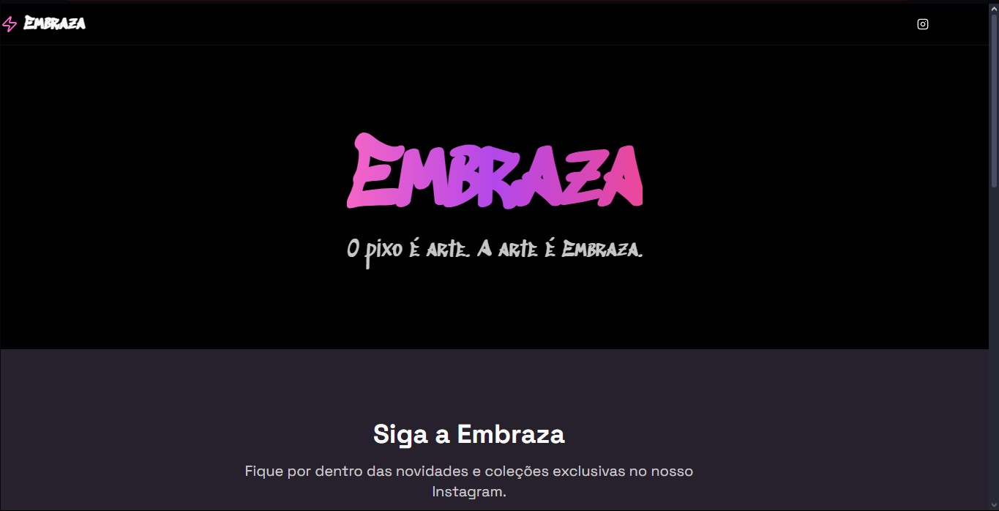

# Embraza - Landing Page

Landing page desenvolvida para a marca **Embraza**, com foco em **estilo urbano** e **design moderno**.  
Projeto realizado sob encomenda para **Luis Eduardo**.

---

## 🚀 Tecnologias Utilizadas

- **[Next.js](https://nextjs.org/)** – Framework React para SSR/SSG
- **[React.js](https://reactjs.org/)** – Biblioteca principal para construção da interface
- **[TailwindCSS](https://tailwindcss.com/)** – Estilização rápida e responsiva
- **[Netlify](https://www.netlify.com/)** – Deploy e hospedagem

---

## 📸 Preview

---

## 🖥️ Deploy

A landing page está disponível em produção no Netlify:
https://embraza.netlify.app/
